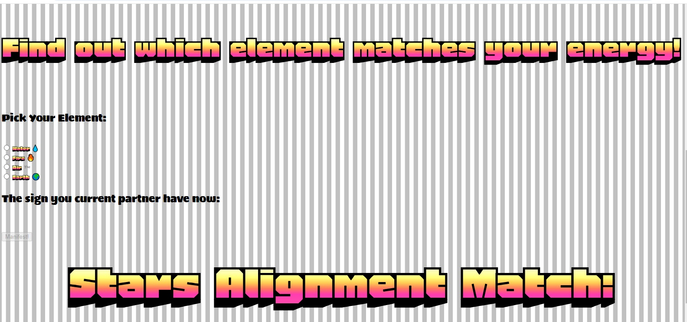

# Star Fortune

Star fortune contains a fun fortune guessing game correlated to elemental signs of a person. The game targets players who are wanting to know whether their partner or date share a compatible elemental sign.

Nowadays where everything is online, including dating, it is an easy access to those who want to look for signs and who value the correlation of astronomy in love and destiny.

![Responsice Mockup] (assets/images/READ-ME-images/SS desktop page.jpg)

## Features 

The projects has a title that give the audience the context of the game.

Underneath is a photo of the four elemental characters. Below the image shows options on which element you think you are which will be matched to a random element.

A submit button shall be clicked which the will trigger a function showing whether the signs are compatible or not.

### Existing Features

- __Heading__

  - Featured at the top of the page, the Star Fortune heading is colorful and presents a perfect impression for an audience in first glance. Upon viewing the page, the user will be able to see the name of the game.

![Logo] (assets/images/READ-ME-images/SS desktop page.jpg)

- __The Game Area__

  - This section will allow the user to play the maths game. The user will be able to easily see icons optionas of elements which are water,air,fire and earth with emojis as it follows the trend.
  - 
  - The user will be able to select the type element they want to find a match with. 

- __Random Element Picker__

  - The game will then select a random element which will show as the probable element of the gamer's partner or current date.
  - The user will be able to submit their answer and a compatibility check will make it known to the user if they are compatible or not with the person. 

- __The Compatibility Area__

  - This section will allow the user to see exactly whether they are compatible, incompatible, or the stars have perfectly aligned for them. 

## Testing 

The website have been tested on different devices such as phone, ipad, desktop and notebooks.
The sizes vary and adjusts as per the device and the operating system.

### Validator Testing 

- HTML
    - No errors were returned when passing through the official [W3C validator](assets/images/READ-ME-images/html validator.png)
- CSS
    - No errors were found when passing through the official [(Jigsaw) validator](assets/images/READ-ME-images/css validator.png)
- JavaScript
    - No errors were found when passing through the official [Jshint validator](https://jshint.com/)
      - The following metrics were returned: 
      - There are 8 functions in this file.
      - Function with the largest signature take 2 arguments, while the median is 1.
      - Largest function has 7 statements in it, while the median is 1.
      - The most complex function has a cyclomatic complexity value of 10 while the median is 1.

## Deployment

- The site was deployed to GitHub pages. The steps to deploy are as follows: 
  - In the GitHub repository, navigate to the Settings tab 
  - From the source section drop-down menu, select the Master Branch
  - Once the master branch has been selected, the page will be automatically refreshed with a detailed ribbon display to indicate the successful deployment. 

The live link can be found here - https://code-institute-org.github.io/love-maths/

## Credits 

In this section you need to reference where you got your content, media and extra help from. It is common practice to use code from other repositories and tutorials, however, it is important to be very specific about these sources to avoid plagiarism. 

You can break the credits section up into Content and Media, depending on what you have included in your project. 

### Content 

- The text for the Home page was taken from Wikipedia Article A
- Instructions on how to implement form validation on the Sign Up page was taken from [Specific YouTube Tutorial](https://www.youtube.com/)
- The icons in the footer were taken from [Font Awesome](https://fontawesome.com/)

### Media

- The photos used on the home and sign up page are from This Open Source site
- The images used for the gallery page were taken from this other open source site

Congratulations on completing your Readme, you have made another big stride in the direction of being a developer! 

## Other General Project Advice

Below you will find a couple of extra tips that may be helpful when completing your project. Remember that each of these projects will become part of your final portfolio so it’s important to allow enough time to showcase your best work! 

- One of the most basic elements of keeping a healthy commit history is with the commit message. When getting started with your project, read through [this article](https://chris.beams.io/posts/git-commit/) by Chris Beams on How to Write  a Git Commit Message 
  - Make sure to keep the messages in the imperative mood 

- When naming the files in your project directory, make sure to consider meaningful naming of files, point to specific names and sections of content.
  - For example, instead of naming an image used ‘image1.png’ consider naming it ‘landing_page_img.png’. This will ensure that there are clear file paths kept. 

- Do some extra research on good and bad coding practices, there are a handful of useful articles to read, consider reviewing the following list when getting started:
  - [Writing Your Best Code](https://learn.shayhowe.com/html-css/writing-your-best-code/)
  - [HTML & CSS Coding Best Practices](https://medium.com/@inceptiondj.info/html-css-coding-best-practice-fadb9870a00f)
  - [Google HTML/CSS Style Guide](https://google.github.io/styleguide/htmlcssguide.html#General)

Getting started with your Portfolio Projects can be daunting, planning your project can make it a lot easier to tackle, take small steps to reach the final outcome and enjoy the process! 