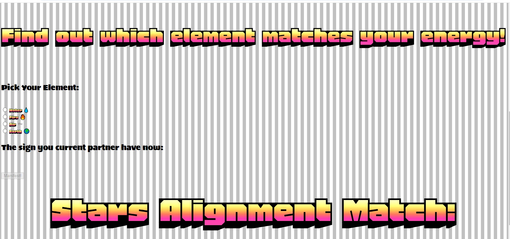
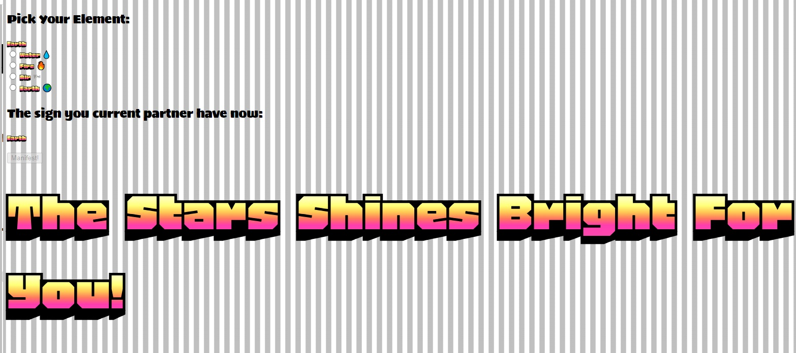
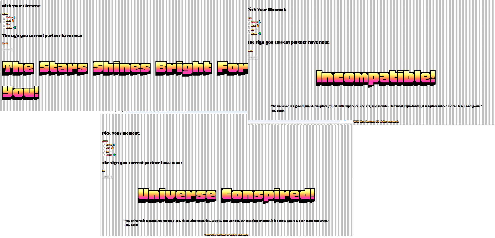

# Star Fortune

Star fortune contains a fun fortune guessing game correlated to elemental signs of a person. The game targets players who are wanting to know whether their partner or date share a compatible elemental sign.

Nowadays where everything is online, including dating, it is an easy access to those who want to look for signs and who value the correlation of astronomy in love and destiny.

![Front] (assets/images/READ-ME-images/front.jpg)

## Features 

The projects has a title that give the audience the context of the game.

Underneath is a photo of the four elemental characters. Below the image shows options on which element you think you are which will be matched to a random element.

A submit button shall be clicked which the will trigger a function showing whether the signs are compatible or not.

### Existing Features

- __Heading__

  - Featured at the top of the page, the Star Fortune heading is colorful and presents a perfect impression for an audience in first glance. Upon viewing the page, the user will be able to see the name of the game.

![Heading] (assets/images/READ-ME-images/front.jpg)

- __The Game Area__

  - This section will allow the user to play the maths game. The user will be able to easily see icons optionas of elements which are water,air,fire and earth with emojis as it follows the trend.
  - 
  - The user will be able to select the type element they want to find a match with. 

- __Random Element Picker__

  - The game will then select a random element which will show as the probable element of the gamer's partner or current date.
  - The user will be able to submit their answer and a compatibility check will make it known to the user if they are compatible or not with the person. 

- __The Compatibility Area__

  - This section will allow the user to see exactly whether they are compatible, incompatible, or the stars have perfectly aligned for them. 

## Testing 

The website have been tested on different devices such as phone, ipad, desktop and notebooks.
The sizes vary and adjusts as per the device and the operating system.

### Validator Testing 

- HTML
    - No errors were returned when passing through the official [W3C validator](assets/images/READ-ME-images/html validator.png)
- CSS
    - No errors were found when passing through the official [(Jigsaw) validator](assets/images/READ-ME-images/css validator.png)
- JavaScript
    - No errors were found when passing through the official [Jshint validator](https://jshint.com/)
      - The following metrics were returned: 
      - There are 8 functions in this file.
      - Function with the largest signature take 2 arguments, while the median is 1.
      - Largest function has 7 statements in it, while the median is 1.
      - The most complex function has a cyclomatic complexity value of 10 while the median is 1.

## Deployment

- The site was deployed to GitHub pages. The steps to deploy are as follows: 
  - In the GitHub repository, navigate to the Settings tab 
  - From the source section drop-down menu, select the Master Branch
  - Once the master branch has been selected, the page will be automatically refreshed with a detailed ribbon display to indicate the successful deployment. 

The live link can be found here - https://github.com/jammy-8/Star-Fortune.git

## Credits 

These are the ff links used for media int the website:
- https://medium.com/@forfrontendofficial/14-css-shine-effects-for-frontend-3194b796c174
- https://www.google.com/search?sca_esv=e6eef6b59335224c&sxsrf=AHTn8zrZtBC6Pt2N-aZPDBOwKhzMdTSj8A:1741169308559&q=four+elements+of+nature+cute&udm=2&fbs=ABzOT_CWdhQLP1FcmU5B0fn3xuWpA-dk4wpBWOGsoR7DG5zJBkzPWUS0OtApxR2914vrjk4ZqZZ4I2IkJifuoUeV0iQtITiOPPo9tDzmt9ZPGYJiIZsm486MGOh4UNsgv2B9Z6WUaeLZGNgaHB_AtBTE7AunWjPAOF4aOD--bA-K543ZNFHq-sPp7pIfAO-61_X5rSPQ0nNf9ADJmtjajpYev9Dco2eP7g&sa=X&ved=2ahUKEwjSpoWR2fKLAxU0TkEAHf_oE_QQtKgLegQIERAB&biw=1600&bih=739&dpr=1#vhid=hIvEorEGwcQx6M&vssid=mosaic
- https://www.google.com/url?sa=i&url=https%3A%2F%2Fwww.istockphoto.com%2Fillustrations%2Fthe-four-elements&psig=AOvVaw2u_Ln14DI5xp-JU1EjIK5w&ust=1741277217029000&source=images&cd=vfe&opi=89978449&ved=0CBQQjRxqFwoTCKiM9qGp84sDFQAAAAAdAAAAABAJ
- 

### Content

- The text for the Home page was generated by the author.
- Instructions on how to implement form validation on the Sign Up page was taken from the Code Institute instructions.
- The icons in the footer were taken from [Font Awesome](https://fontawesome.com/)

### Media

- The photos used on the home and sign up page are from This Open Source site
- The images used for the gallery page were taken from online sites which are all enumerated int the credits sexction.

